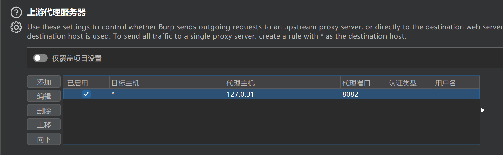

# BurpGuard

在Burp的两端部署基于`mitmproxy`的上下游代理，以应对HTTP请求的加密传输问题，得益于`mitmproxy`为`Python`提供了丰富的API。

**注：要求使用者具备一定Python基础**

**如需配合SQLMap等自动化工具，使其走Burp的代理或者8082端口即可。**
## 使用方法
1. 安装依赖及证书：

```python
$ pip install -r requirements.txt
```

证书在系统当前用户目录下的`.mitmproxy`，选择`cer`后缀的证书安装至系统。

2. 查看使用帮助：

```python
$ python BurpGuard.py -h

usage: BurpGuard.py [-h] [-p1 PORT1] [-p2 PORT2] [-burp BURP] [-proxy PROXY] [-v]

BurpGuard

options:
  -h, --help            show this help message and exit
  -p1 PORT1, --port1 PORT1
                        客户端代理端口, 默认8081
  -p2 PORT2, --port2 PORT2
                        Burp上游代理端口, 默认8082
  -burp BURP, --burp BURP
                        burp端口, 默认8080
  -proxy PROXY, --proxy PROXY
                        最终请求代理
  -v, --verbose         输出详细请求日志, 默认关闭
```
3. 分别在`ClientProxyHandler.py`和`BurpProxyHandler.py`中编写请求加解密逻辑：

`ClientProxyHandler.py`: **处理客户端的请求并转发给burp，通常用于解密请求和加密响应**

`BurpProxyHandler.py`: **处理Burp的请求并转发给源服务器，通常用于加密请求和解密响应**

4. 以默认参数运行BurpGuard：
```python
$ python BurpGuard.py

[*] BurpGuard 启动成功
[*] 客户端代理端口: 8081
[*] Burp端口: 8080
[*] Burp上游代理端口: 8082
[*] 最终代理链: 客户端->8081->Burp(8080)->8082
```

更改客户端（浏览器/APP）的代理端口：


为burp配置上游代理：



**5. 开始你的渗透之旅！**

## 编写指南

1. 获取请求对象，读取HTTP请求的基本信息
```python
def request(self,flow: http.HTTPFlow):
    # 获取请求对象，其中包含了一个HTTP请求的相关信息
    req = flow.request
    # 获取请求的host, 不包含端口
    host = req.host
    # 获取请求的端口
    port = req.port
    # 获取请求的URI路径
    path = req.path
    # 获取请求的方法
    method = req.method
    # 获取请求的查询参数，即URL中的参数
    # example: https://example.com/?id=1
    query = req.query
    if query.get("id"):
        query["id"] = 2
    # 读取完整的请求URL
    url = req.url
    # 判断特定请求
    if host == 'www.example.com' and path == '/login':
        # 在这里编写你的代码
        # ..
```
2. 处理请求头
```python
def request(self,flow: http.HTTPFlow):
    req = flow.request
    # 修改请求头,需要注意判空
    if req.headers.get('User-Agent'): 
        req.headers['User-Agent'] = 'Mozilla/5.0 (Windows NT 10.0; Win64; x64) AppleWebKit/537.36 (KHTML, like Gecko) Chrome/80.0.3987.132 Safari/537.36'
    # 添加自定义请求头
    req.headers.add('X-Custom-Header', 'Custom-Value')
```

3. 处理请求body
```python
def request(self,flow: http.HTTPFlow):
    req = flow.request

    # 获取JSON并修改
    # {"data": "test"}
    if req.json():
        json_data = req.json()
        if "data" in json_data:
            json_data["data"] = "data"
            req.content = json.dumps(json_data).encode()
    
    # 获取表单数据
    # id=1&name=test
    if req.urlencoded_form:
        form_data = req.urlencoded_form
        if form_data.get("id"):
            form_data["id"] = 2
    
    # 修改body原始字节数据
    if req.content:
        req.content = "data".encode()
```
4. 处理响应
```python
def response(self,flow: http.HTTPFlow):
    # 获取响应对象
    rsp = flow.response
    # 获取响应状态码
    status_code = resp.status_code
    # 获取并修改响应的body的原始字节
    rsp.content = "data".encode()

    # 修改响应的body的JSON数据,如果不是JSON数据, 会抛出异常，建议判断Content-Type
    if "application/json" in rsp.headers.get("Content-Type"):
        json_data = rsp.json()
        if "data" in json_data:
            json_data["data"] = "data"
            rsp.content = json.dumps(json_data).encode()
    
    # 修改响应的文本数据
    if rsp.text:
        rsp.text = "data"
```
5. 配合[JsRpc](https://github.com/jxhczhl/JsRpc)
```python
def request(self,flow: http.HTTPFlow):
    # 获取请求对象，其中包含了一个HTTP请求的相关信息
    req = flow.request
    
    data = {
        "group": "zzz",
        "action": "decrypt",
        "param": json.dumps({"data":req.text})
    }
    response = self.client.post("http://127.0.0.1:12080",data=data)
    decrypt_data = response.text
```
测试demo: 
```python
import requests

url = "http://127.0.0.1:12080/go"
data = {
    "group": "zzz",
    "action": "encrypt",
    "param": json.dumps({"data": "需要加密的数据"})
}
res=requests.post(url, data=data)
print(res.text)
```

